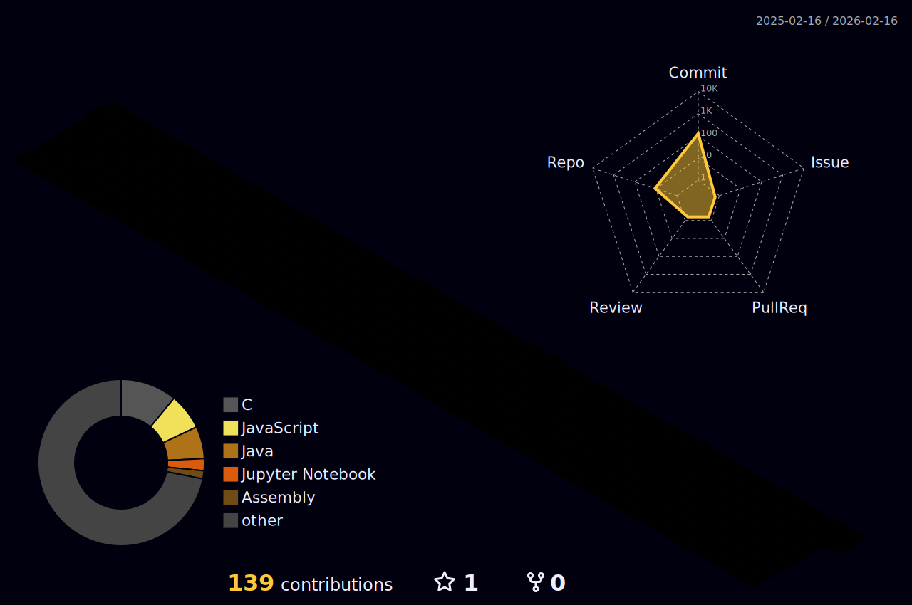

### Olá, me chamo Inácio Lopes 

   
 <h2>Sobre mim</h2>
    Estou atualmente cursando a faculdade de Ciencias da Computaçao, estou estudando áreas como computação quantica, sistemas embarcados e redes de computadores 

   
  <h2>Linguagens e Ferramentas</h2>

   
   
   
   
   
 

  ### 📧 Contato

